[← All weeks](../)

## 📝Brief

2029, former Republic of Bezoslavia: after the Second Corporate War of Alphabets,
the new regime has banned all organizational branding (logos, trademarks, ads)
as well as, due to a concession to the High Church of Imagery, all photorealism. Signs and
packages get **at most three English words** describing their contents. Still
legal: abstract forms/symbols, non-photoreal representational imagery,
non-corporate typefaces, unlimited color.

**Task:** pitch a post-brand visual communication system for one surviving 2026
company, applied to a **storefront**, a **product package**, and **one more
piece of collateral**.

---

## 📷Client: "⬛lock"

> ⚠️ _(to not end up on a watchlist for criticizing the surveillance state, I've redacted the actual name of the company)_

Because of the wording of the prompt, my mind immediately went down the "dystopian" angle, thinking of the "technofascist" companies of today. I thought it'd be an interesting exercise to try putting a positive spin on a blatantly evil company, all while adding subtle hints of criticism. Essentially, I'm making propaganda, so that when the robot police dogs attack, I can claim on my resume I have valuable propagandizing experience and will be spared.

While there are many _splendid_ companies to choose from in this realm of technology, I decided on **⬛lock** since a) they're probably the most topical right now, and b) they have an easily identifiable "product"/"service". Other companies, like **⬛alantir**, tend to be more nebulous in what they actually do.

## 🖼️Mood Board

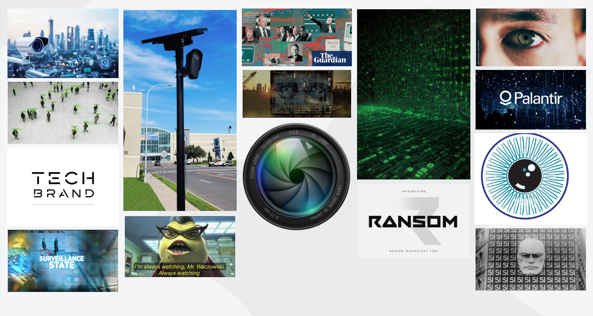

_The mood board for this company._

**⬛lock**'s main visible "commodity" of cameras gives it an immediate, obvious metaphor: eyes. 👁️👁️ After all, cameras are essentially mechanical eyes: diaphragm vs iris, aperture vs pupil, etc. Additionally, these cameras are constantly monitoring, which is what eyes do: always watch.

A lot of inspiration was also drawn from:

- Sci-fi high-tech futurism, much of which tends to be dystopian: Cyberpunk 2077, 1984, Brave New World, The Matrix, Blade Runner, etc.
- Modern tech company branding: digital- or futuristic-looking typography, clean colors, attempted friendliness, etc.: Apple, Microsoft, Google, etc.
- Security camera/CCTV POV footage, combined with computer vision, identifying people/objects
- "Cyberspace": floating symbols/graphs/code, green-on-black text, etc.
- Examples of authoritarian propaganda, particularly around control and "safety"

---

## 👀The Visual System

As mentioned above, the challenge here is to frame a terrible company in a positive way, all while adding a hint of protest.

### ⌨️Typography

I went into the "Techno" fonts section on Google Fonts and found [Space Grotesk](https://fonts.google.com/specimen/Space+Grotesk?categoryFilters=Appearance%3A%2FTheme%2FTechno&preview.script=Latn), which suits the futuristic, dystopian tech company vibe well. It checks all the boxes:

- ✅ Sans serif
- ✅ Very clean feel
- ✅ Lots of tight angling, reminiscent of digital, 7-segment letters/numbers
  - Notable letters: lowercase g, capital R, lowercase t

It also clears the one typography rule the regime actually enforces: no corporate lineage. Space Grotesk is an open-source face (SIL Open Font License) with no "old corporate power" currently using it in their active branding, at least to my knowledge.

  
SLEEP WELL CITIZEN

  

    ABCDEFGHIJKLMNOPQRSTUVWXYZ 
    abcdefghijklmnopqrstuvwxyz 
    0123456789 &nbsp; &mdash; / . , : ( ) # &amp;
  

  
Safety is not something you do. It is something done for you, continuously, at no charge. Every door accounted for. Every hour on file. Sleep well, knowing someone is awake on your behalf.

### 🎨Color

While the brief allows for unlimited color, the future is bleak and dreary, so no need for lots of color. Also, from a propaganda perspective, color is unnecessary and excites unwanted feelings of joy and happiness. A greyscale palette feels emotionless and institutional, so 90% of the system is black, white, and grey. To add a _bit_ of color, there's dark green, which couples well with the greyscale palette to give a cyberspace/digital feeling.

### 🪬Symbol

> ⚠️ Immediate disclaimer: the regime banned logos and trademarks, so this isn't a logo: it's a symbol (wink), as symbols are approved ("abstract visual forms, designs, and symbols"). Realistically, anyone could draw a similar eye and claim it. Plus, with trademarks being banned, **⬛lock** has no real ownership over it - it's just an eye, after all.

As I said above, the symbol is an eye. While obvious, I feel like an eye is still the best kind of symbol for this company. After all, "always watching" is what these cameras do. So:

  <figure style="flex: 1; margin: 0;">
    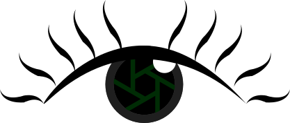
    <figcaption style="text-align: center; font-size: 0.85rem; opacity: 0.7; margin-top: 0.4rem;">Full color</figcaption>
  </figure>
  <figure style="flex: 1; margin: 0;">
    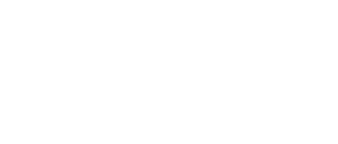
    <figcaption style="text-align: center; font-size: 0.85rem; opacity: 0.7; margin-top: 0.4rem;">Single color</figcaption>
  </figure>

Obviously, this is a human eye. However, the design also works in other details/aspects of the company:

- The _hexagonal swirl_ is meant to look like a **camera aperture**.
- The _light mark_ helps to sell it as a human eye; without it, the eye looks too digital and camera-esque. I have to humanize my dystopian propaganda tech, after all.
- The _eyelashes_ are meant to somewhat resemble bird feathers or wings, giving a subtle nod to the current avian name of the company.
- The eye _stares straight_ at the user, conveying the "always watching" theme.

These eyes were made in Inkscape, a free vector graphics program / Adobe Illustrator alternative.

### 📔Wording and Language

The brand wording should be a mix of big tech and dystopian propaganda. These two tend to be both parallel and perpendicular at times.

Dystopian propaganda tends to be:

- **Selectively worded/bureaucratic**: Why say "war" when you can say "global struggle for justice" or something?
- **Parental**: Think "for your own good". In this company's case, "constant surveillance is for your own safety".
- **Dehumanizing/unfeeling**: Removing human emotion, and even human subjects, from the wording. This tends to be in a passive voice. For example, "measures have been enacted" instead of "we are arresting people".

Oftentimes, these points contradict each other: "for your safety," said in a cold, emotionless tone.

Meanwhile, big tech language tends to be a bit more personable; i.e., it emphasizes the "you". As in, "bring stability to your busy life with the X Digital Planner".

### 🆒Naming

As far as naming goes, it needs to convey a few things:

- A guise of concern for personal safety: "peace", "safeguard", "safety", "protection"
- Constant monitoring: "always-watching", "perpetual", "continuous", "steadfast"
- The product itself: "monitoring", "cameras", "tracking"

I decided upon:

  
Always-Watching Safety Cameras

This pulls from each of the three buckets, while having a "Big Brother" feel. It also meet's the regime's criteria of using three or less words that "specifically describe their contents," and counts hyphenated/compound words as one. Every word is literal as well: they _are_ cameras, they _are_ sold for/"provide" "safety", and they _do_ constantly track, AKA "watch".

---

## 🖌️System Applied

Since the state banned photorealism for civilian communication, none of the pieces are photographs; rather, they're icons, which the law still permits. So treat these as schematics, rather than renders. Using Photoshop would get me sent to an internment facility for people who commit branding violations.

Also, for the sake of having a "product" to sell, I'm going to claim that after the Second Corporate War of Alphabets, **⬛lock** expanded into the market of personal safety cameras: think Ring, Google Nest, etc.

### 🏪Storefront

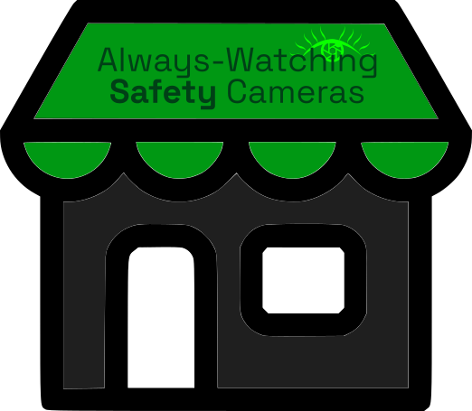

_A sample Always-Watching Safety Cameras storefront._

  
View illegal, non-compliant imagery with a previous "symbol" iteration

  

    
Restricted &middot; Photoreal reference &middot; Storefront &middot; Viewing logged and retained

    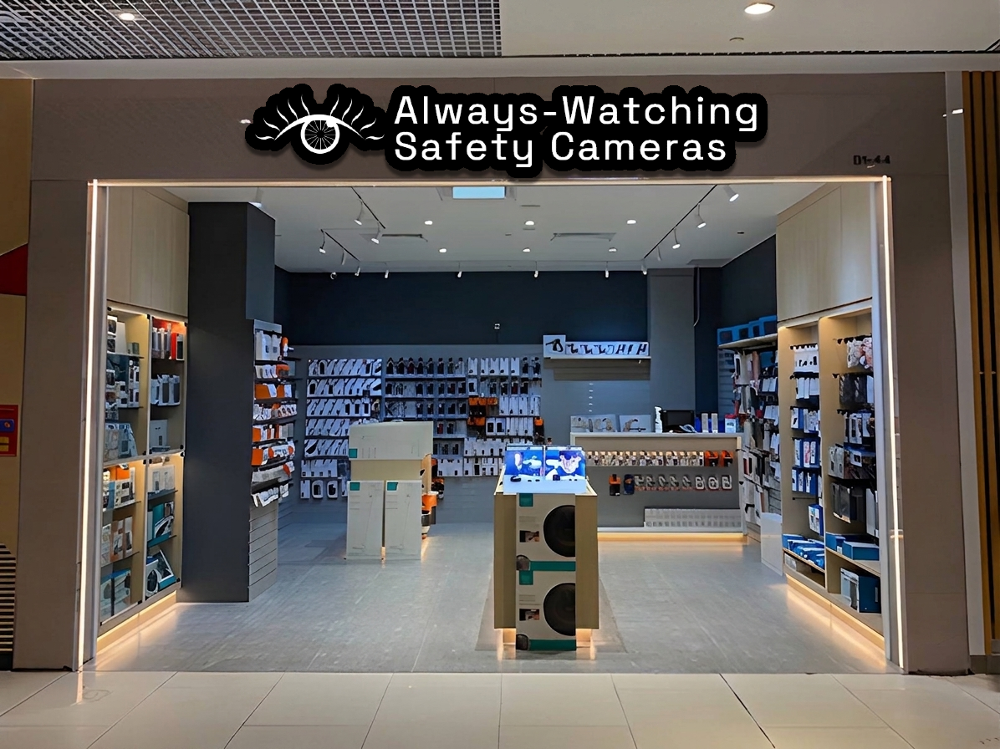
  

### 📦Product with Packaging

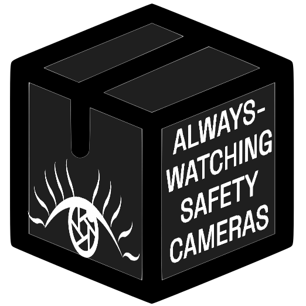

_A sample Always-Watching Safety Cameras package._

  
View illegal, non-compliant imagery with a previous "symbol" iteration<

  

    
Restricted &middot; Photoreal reference &middot; Packaging &middot; Viewing logged and retained

    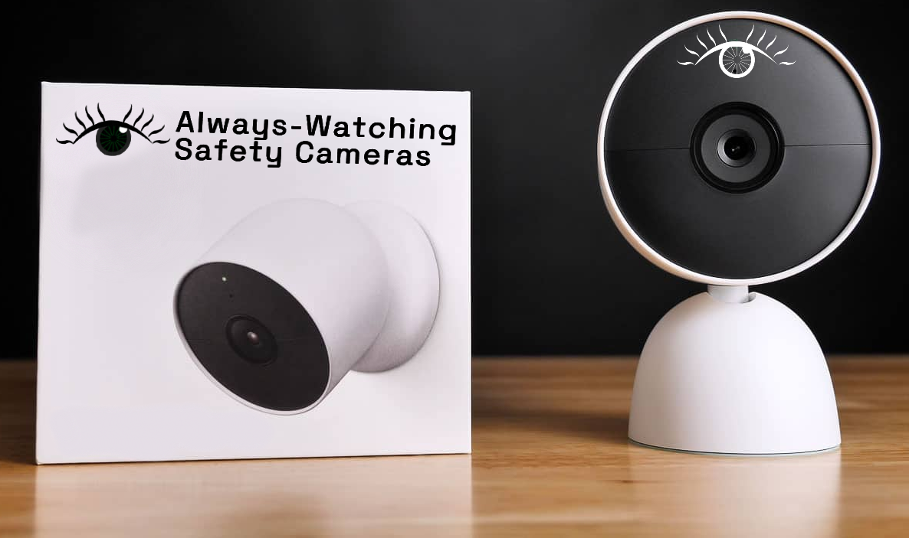
  

### 🎥Sample Product: Camera

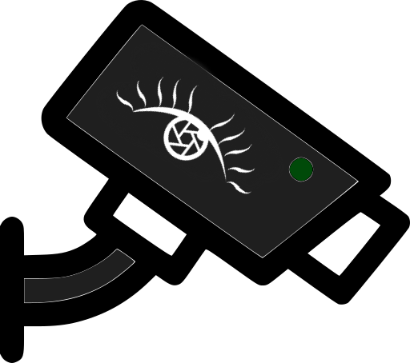

_A sample Always-Watching Safety Cameras camera._

  
View illegal, non-compliant imagery with a previous "symbol" iteration<

  

    
Restricted &middot; Photoreal reference &middot; Camera unit &middot; Viewing logged and retained

    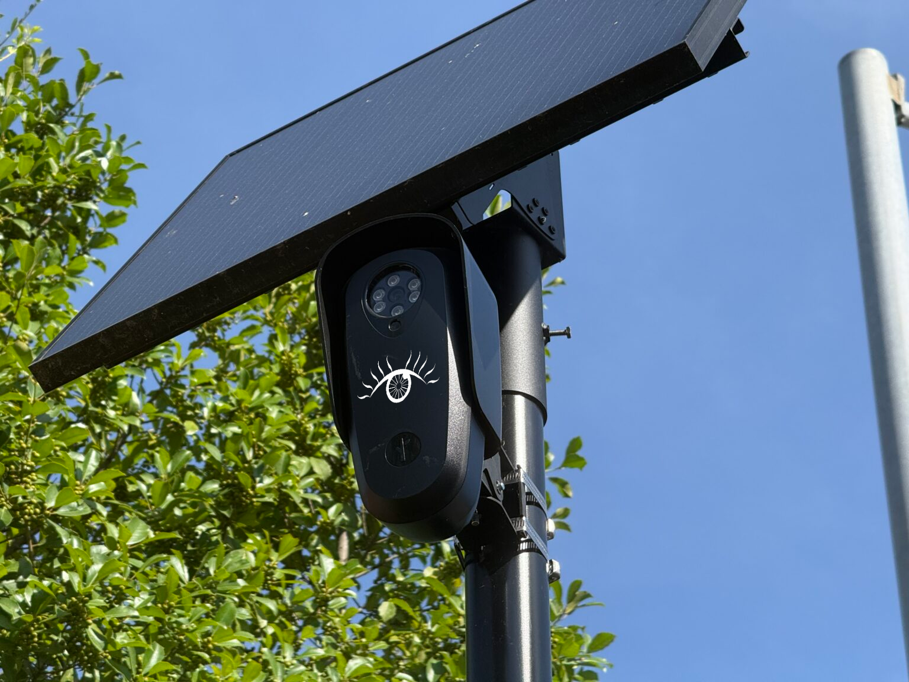
  

---

## ✅Feedback Items and Revisions

### 🗣️Feedback

Some points of feedback included:

- **Make the storefront more readable and visually egaging**: I agree wholeheartedly. For reference, here's the old mockup:

  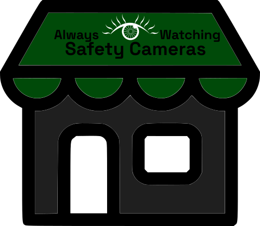

  _The old store mockup._

  The old mockup was a bit thrown-together, and the "eye as dash" didn't really work as well as I had wanted.

  One reviewer suggested that:

  > It could be interesting to see how it would look if the “i” in “watching” incorporated the “logo” instead.

  ...which I found very interesting. I played around with a bit, and found it worked pretty well with the correct color scheme, so I added it to the final design.

  Which, that led me to simplify the colors as well, in order to have more options visually for the company. My first draft had a whole "totally not branding" color guide of specific colors:

    

    

      

      

        Black
        #000000
      

    

    

      

      

        White
        #FFFFFF
      

    

    

      

      

        Grey
        #1F1F1F
      

    

    

      

      

        Green
        #004a09
      

    

  

  ...but a) since that's more traditional branding, and b) it's very limiting, into the garbage bin it goes 🚮

- **Change the hyphenation to "Always Watching Safety-Cameras"**: I decided not to do this one; it does make sense to me, but in the end I felt my original name is more descriptive. I talk about this in [Naming](#naming), but with a restrictive three-word limit, each word needs to have a purpose. Maybe just to me, _always-watching + safety + cameras_ is more descriptive than _always + watching + safety-cameras_. Also, _always-watching_ feels like a more proper hyphenation than _safety-cameras_, but again... maybe just me.
- **Make the eye look more robotic/simplify the design for smaller sizes**: I agree with this one too; I think the earlier attempts at this were too complex. Getting feedback from multiple people on this made me re-think how the eye could subtlety be more mechanical and evil, and what I found was using a literal camera aperature design worked best. It's a) simpler / less lines, so it'll look less cluttered at smaller sizes, and b) more related to cameras.

  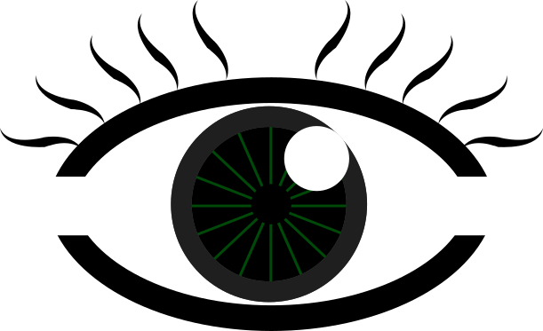
  &rarr;
  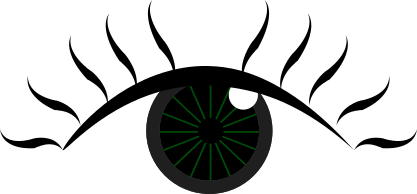
  &rarr;
  
  
<b>v1</b> The original design.

  
<b>v2</b> A slight re-design for the draft submission, dropping the thick eyelids for one thinner top eyelid, meant to emphasize the iris more.

  
<b>v3</b> The peer feedback revision, shrinking the iris a tad to make it fit within bounds better and swapping the inner design for a camera aperature.

