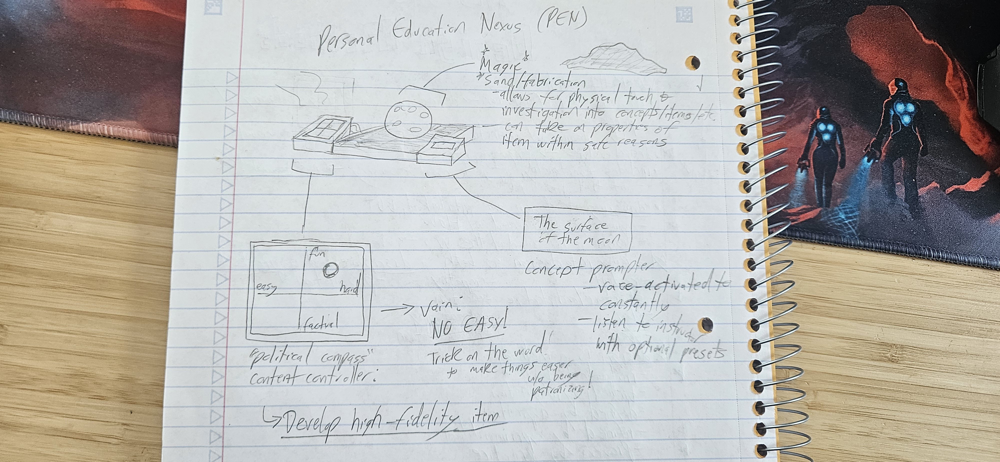
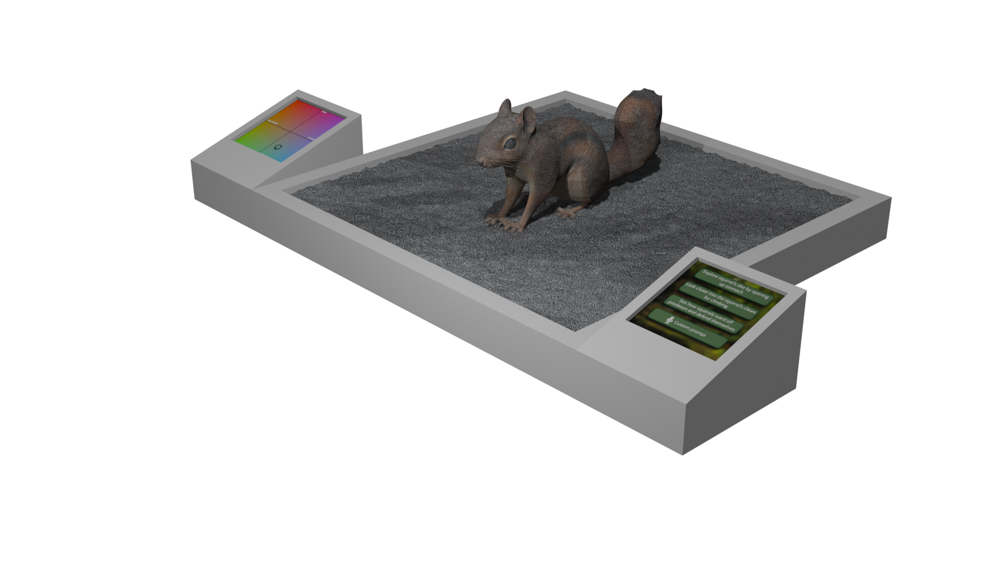
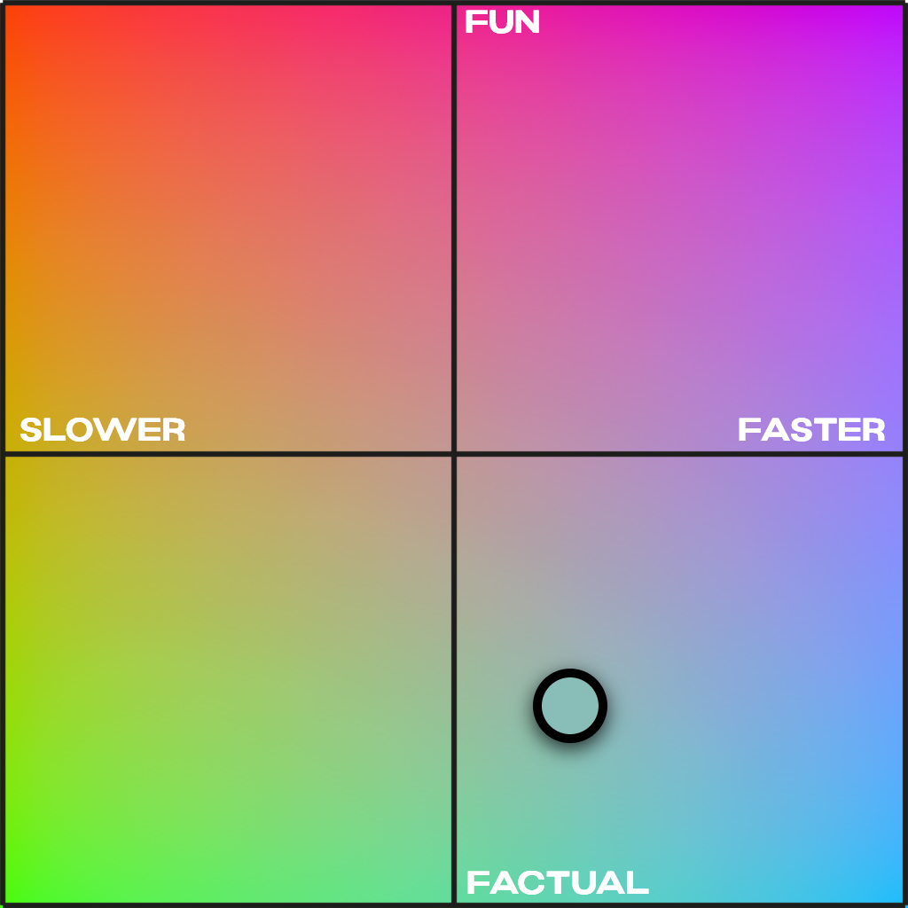
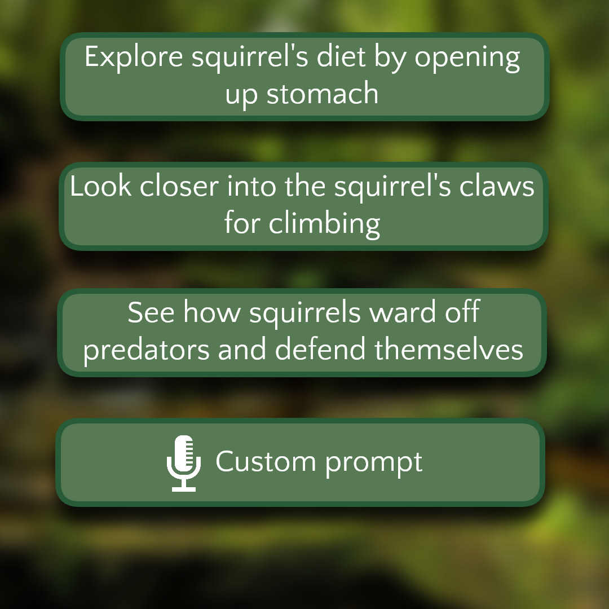

[← All weeks](../)

## 📝Brief

Take the interface concept developed for a partner in the first class and,
using their feedback, produce a considerably higher-fidelity prototype.

## 🗣️Interview & Context

My partner for this assignment was **Annaleise**. During her day, the biggest challenge to her was with her mammology class. She said that:

- She felt she could've learned more, but the class structure impeded that
- The lab for that day was overly-difficult
- The lecture content was dry and "sleepy"

She conveyed that she had a deep desire to learn and be constantly challenged in her education, but alas, the format and structure of mammology made that difficult. Annaleise also told me she's a hands-on learner, which lectures don't exactly support as a learning style.

So let's fix that!

## 💡Ideation and Initial Prototype

I wanted this device to focus on giving education a personal "touch" (hands-on learner pun intended). So, this device is the **Personal Education Nexus**, or **PEN** for short.

The PEN has two main features:

1. Allows the user to adjust the course content for _themselves_, changing their perception of words on a slide deck, words from a professor's mouth, etc. This would have two axes of control for course delivery and content, giving users a single screen for controlling multiple aspects of a lecture.
2. A magic 3D sandbox, which will use magic sand to generate a 3D model of a specific topic in a lecture, allowing students to feel any item typed into it. Said model would take on the properties of the object within safe boundaries. For example, I could generate a shark and its teeth would feel like real shark teeth, but I couldn't accidentally cut myself on said teeth. The content is controlled by a prompt box.

_The initial sketch with notes._

## 🔁Feedback and Second Prototype

Annaleise's feedback for this device was:

- Initially, my labels for the 2D grid were _"fun ↔ factual"_ and _"easy ↔ hard"_; the former was fine, but using "easy" specifically felt patronizing or mean. We should update the word to imply something similar, but have a less-harsh feeling.
- The prompt box was vague. Initially, I assumed it would just be something to type out the item, but she suggested that it a) include pre-made prompts, based on the instructor's current content, and b) it have voice-activated custom prompts; since we're working with magic, we can assume it wouldn't bother the class, and it'd be quicker and easier than having to type a prompt.

Thus, I present - the updated PEN!

_A static render of the PEN._

<model-viewer
  src="model/PEN.glb"
  poster="img/PEN-render.png"
  alt="3D model of the PEN device"
  auto-rotate
  camera-controls
  shadow-intensity="1"
  loading="lazy"
  style="width:100%;height:480px;background:#f4f4f4;border-radius:8px;">
</model-viewer>

_3D model made in Blender - drag to orbit, scroll to zoom. [Download the .glb](model/PEN.glb)._

### 🤔Feedback Considerations

#### 🎛️Content Picker

The first feedback item, the content picker, was updated to use _"slower ↔ faster"_ instead of _"easy ↔ hard"_. While still not super kind on the wording (maybe even moreso), it should hopefully have more semantic information about adjusting the course speed.

Also, I made the background a gradient, so the color present in the picker should be a vague indication of what setting a user is. While vague (green = slower and factual?), it should at least look pretty for a background of this UI.

_The updated content picker._

#### 🎙️Sand Pit Picker

The sand pit picker also incorporates the feedback. Buttons for relevant prompts, as well as a button for custom audio-driven prompts, is also included.

_The updated sand pit picker._
