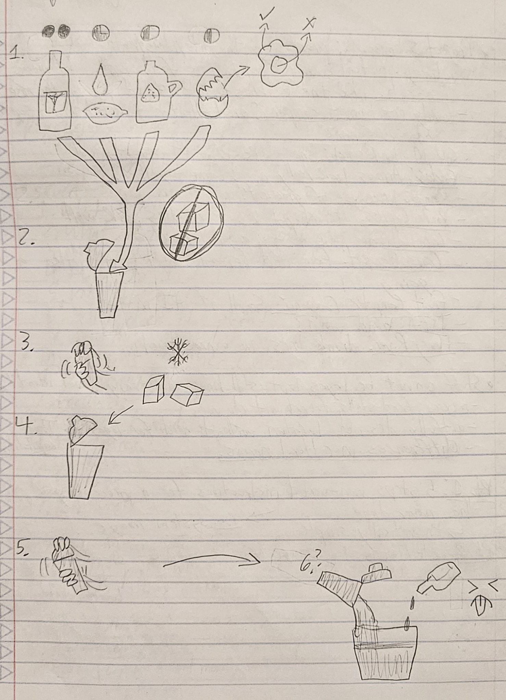
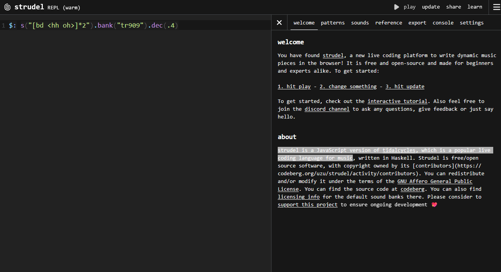
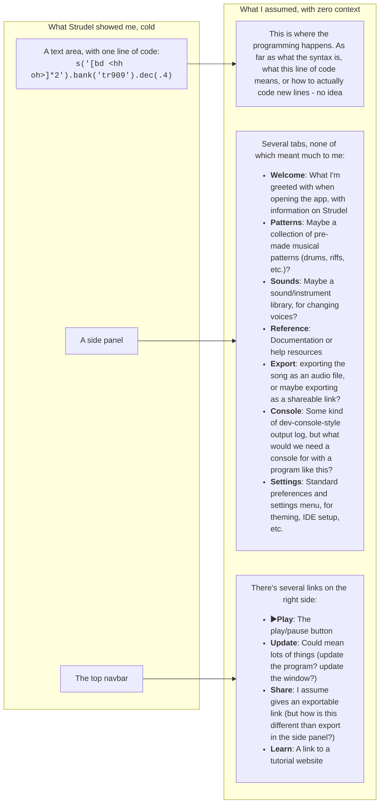
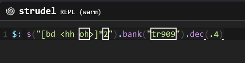
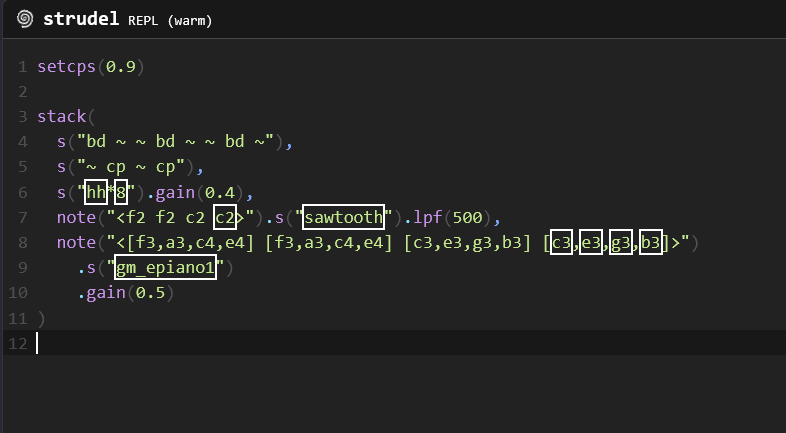
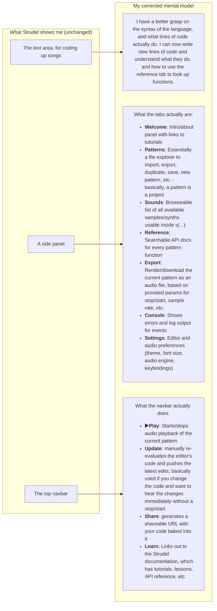

[← All weeks](../)

## Brief

_In class, me and a partner wrote five visual-only instructions to teach each other something. This assignment has two parts: try out each other's
instructions and reflect on how your mental model shifted, then run the same
kind of experiment on yourself with a tool of your choosing._

---

## 🧠Part 1: Visual Instructions Exercise


_The visual instructions I made for concocting a whiskey sour._

For my activity, I described how to make a whiskey sour cocktail. While initially thinking it would be easy, I quickly realized the numerous gaps in my instructions/"design model", and how they might mess with a user's conceptual model. For starters, representing ingredients forced me to rely on some very abstract signifier: a bottle with sugarcane for simple syrup, a jug with corn for whiskey, a "bitter" face emote for Angostura bitters, etc. Even with these signifiers, someone without domain knowledge might have no idea what these ingredients are. Additionally, I had to use pie charts for ratios (i.e. something like 🌕🌕 for the whiskey, 🌗 for the simple syrup, etc.), since numbers weren't allowed. Thankfully, my partner had some existing domain knowledge (his old roommate was a bartender), but without this, the system image would fail to communicate pretty much anything effectively to a true beginner.

My partner's instructions were for stopping on skis, which I felt worked well with making a conceptual model. I have some prior skiing knowledge, but even for someone unfamiliar with skiing, I felt his system image worked well generally. His use of footprints to show foot positioning, direction lines / arrows, and other symbols provided some good signifiers of what each step was. However, his inclusion of a "pizza" shape (which is a metaphor used when telling people how to stop skis) highlighted how visual instructions can rely on these metaphors, and someone without that background would experience a breakdown in their mental model (i.e., "why a pizza"?). Additionally, while the 2D diagrams effectively showed horizontal directional intent, they didn't convey vertical ski movement, other body movements, etc.

Between both these exercises, the big takeaway is conveying information through a system image built only on one's own conceptual model is HARD. Not knowing the gaps, or having to rely on vague signifiers for conveying info, can cause lots of communication issues of a system, especially for a true beginner of a topic.

## 🛠️Part 2 - Building a New Skill

For this part of the assignment, I chose to mess around in [Strudel](https://strudel.cc/), a live coding platform for writing dynamic music. While I have music and coding experience both, I've never used this particular language / libary before, so I wanted to see how quickly I could write a simple song with it.

My SMART goal was:

> Write a simple Strudel pattern, consisting of a drum layer, a bassline, and one melodic/chord layer, using only the Strudel web interface, in under 2 hours.

I had no frame of reference for how to actually use it, and when you go to the website, you're greeted with:


_The Strudel interface, which has one line of code, a side panel, and some links._

...so figured it'd be a good challenge at the very least.

### Reflection: System Image, Before and After

#### Before



Strudel's starting UI is about as unintuitive as it gets. The one line of code is a blank canvas is gibberish, without any knowledge of the syntax itself. There's a small menu up top with the "▶️play" button, as well as some other links with confusing functionality. Additionally, there's a side panel with a bunch of tabs, many of which seemed very... obtuse.

I hit the "▶️Play" button and it played a drum beat. Splendid. One nice thing about the UI is it highlights what's actively playing:


_Strudel playback demonstration._

So, from this line of code the play back was: kick (1), closed hi-hat (2), kick (3), open hi-hat (4), on loop. Because I knew what the sounds were, I could deduce that:

- bd = bass drum
- hh = hi-hat (closed)
- oh = open hi-hat

`s` seemed like notation for song, or set, or segment, or something? `bank` I assume meant the sound bank; from my previous domain knowledge, I know that "tr909" is the Roland TR-909 drum machine and presumably the drums were from that. `.dec(.4)`, on the other hand, I had no idea. Some kind of decay. Also, `*2`, `<hh oh>` - no idea. Coding can sometimes have the problem of people naming variables, functions, etc. poorly in the name of brevity, and this felt like that.

I pretty much struggled for 20 minutes. The "reference" tab was the best internal tool, and even then that was an API reference with a list of functions, not how to get started or actually use them.

#### After

After floundering for 20 minutes, I looked at some YouTube tutorials, referenced Claude, and read some articles. Eventually, I came up with a pattern that hit my original goal of creating a short song with drums, a bassline, and a chord layer - no modification needed:


_The final song I made, with a simple drum beat, a bassline, and some chords._

<audio controls src="audio/beat.wav">
  Your browser does not support the audio element. <a href="audio/beat.wav">Download the audio</a> instead.
</audio>

<details class="contraband">
  <summary>View the Strudel code</summary>
  <div class="body">

```
setcps(0.9)

stack(
  s("bd ~ ~ bd ~ ~ bd ~"),
  s("~ cp ~ cp"),
  s("hh*8").gain(0.4),
  note("<f2 f2 c2 c2>").s("sawtooth").lpf(500),
  note("<[f3,a3,c4,e4] [f3,a3,c4,e4] [c3,e3,g3,b3] [c3,e3,g3,b3]>")
    .s("gm_epiano1")
    .gain(0.5)
)
```

  </div>
</details>



What's crazy to me is, upon reflection, how much I struggled with Strudel despite having significant prior experience with music and coding. I think this is a good example of how a difficult a system image can be to understand, even for someone with domain knowledge. The UI was very obtuse, and the lack of an onboarding experience made it very difficult to get started. I'm not sure the designers of Strudel's web UI intended for it to be a "good experience" and just assume you have a certain level of knowledge, but this demonstrates a lack of effort in designing a system image that is accessible to a wider audience, or even a niche audience for that matter. Without this assignment, I likely would've gotten scared away very quickly.
