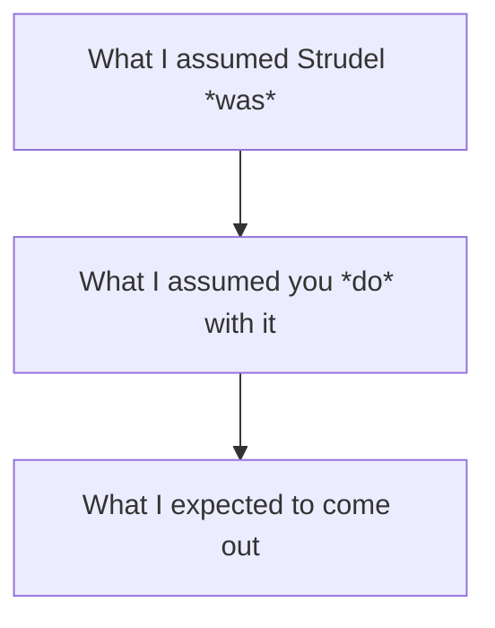
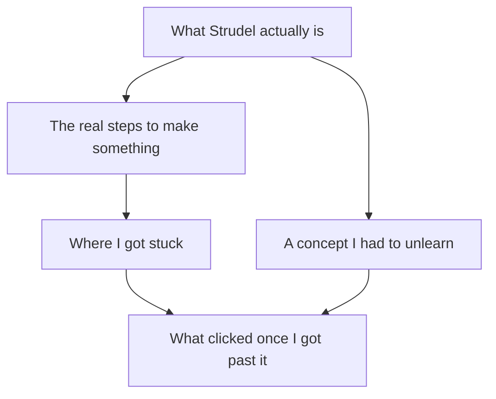

[← All weeks](../)

## Brief

_In class, me and a partner wrote five visual-only instructions to teach each other something. This assignment has two parts: try out each other's
instructions and reflect on how your mental model shifted, then run the same
kind of experiment on yourself with a tool of your choosing._

---

## 🧠Part 1: Visual Instructions Exercise

_The visual instructions I made for concocting a whiskey sour._

For my activity, I described how to make a whiskey sour cocktail. While initially thinking it would be easy, I quickly realized the numerous gaps in my instructions/"design model", and how they might mess with a user's conceptual model. For starters, representing ingredients forced me to rely on some very abstract signifier: a bottle with sugarcane for simple syrup, a jug with corn for whiskey, a "bitter" face emote for Angostura bitters, etc. Even with these signifiers, someone without domain knowledge might have no idea what these ingredients are. Additionally, I had to use pie charts for ratios (i.e. something like 🌕🌕 for the whiskey, 🌗 for the simple syrup, etc.), since numbers weren't allowed. Thankfully, my partner had some existing domain knowledge (his old roommate was a bartender), but without this, the system image would fail to communicate pretty much anything effectively to a true beginner.

My partner's instructions were for stopping on skis, which I felt worked well with making a conceptual model. I have some prior skiing knowledge, but even for someone unfamiliar with skiing, I felt his system image worked well generally. His use of footprints to show foot positioning, direction lines / arrows, and other symbols provided some good signifiers of what each step was. However, his inclusion of a "pizza" shape (which is a metaphor used when telling people how to stop skis) highlighted how visual instructions can rely on these metaphors, and someone without that background would experience a breakdown in their mental model (i.e., "why a pizza"?). Additionally, while the 2D diagrams effectively showed horizontal directional intent, they didn't convey vertical ski movement, other body movements, etc.

Between both these exercises, the big takeaway is conveying information through a system image built only on one's own conceptual model is HARD. Not knowing the gaps, or having to rely on vague signifiers for conveying info, can cause lots of communication issues of a system, especially for a true beginner of a topic.

## 🛠️Part 2 - Building a New Skill

For this part of the assignment, I chose to mess around in Strudel, a live coding platform for writing dynamic music. While I have music and coding experience both, I've never used this particular language / libary before, so I wanted to see how quickly I could write a simple song with it.

I had no frame of reference for how to actually use it, and when you go to the website, you're greeted with:

_The Strudel interface, which has one line of code, a side panel, and some links._

...so figured it'd be a good challenge at the very least.

### Reflection: System Image, Before and After

TODO

AFTER
