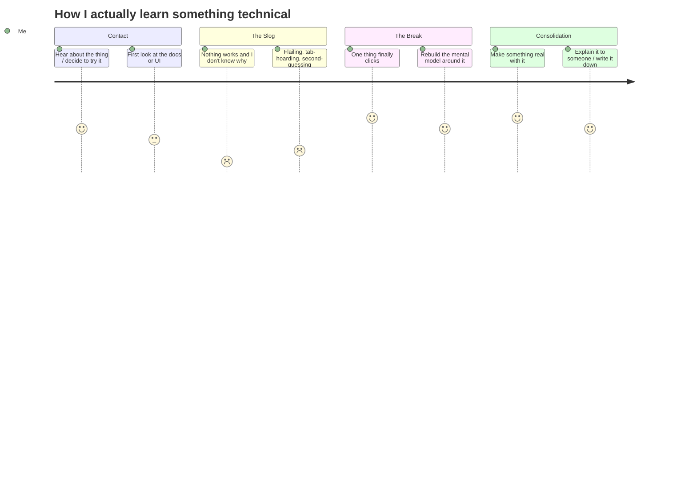

[← All weeks](../)

## 📝Brief

_In class, a partner interviewed me about my learning process and made an
artifact representing how they interpreted it. This assignment has three parts:
share their version, redraw my **own** version (filling in what's missing,
correcting what they misread, and marking the emotionally resonant beats), then
use that revised map to find a point of friction and design a practice that puts
that friction to work during another round of technical learning this week._

---

## 🗺️Part 1: My Partner's Artifact

_The artifact [PARTNER NAME] made after interviewing me about how I learn._

_TODO: Describe what they drew/built — the form it took, the stages they
identified, the metaphor or structure they reached for. Then read it back: what
did they get right? What surprised you about being seen from the outside?_

---

## ✍️Part 2: My Version

_My redrawn version of the same journey._

_TODO: Describe your artifact and why you chose this form for it._

### What Changed

| #   | Their version           | My version              | Why                                  |
| --- | ----------------------- | ----------------------- | ------------------------------------ |
| 1   | _what they had_         | _what it actually is_   | **Correction** — _what they misread_ |
| 2   | _(absent)_              | _the stage they missed_ | **Addition** — _why it matters_      |
| 3   | _a stage they compress_ | _how it really splits_  | **Addition** — _what got flattened_  |

### The Journey, Beat by Beat

_Scores below are emotional, not performance: 5 is energized, 1 is the floor._

#### 🔥Emotionally Resonant Points

> **[BEAT NAME] — _the low._**
> _TODO: What happens here, what it feels like, and why this beat carries more
> weight than the ones around it._

> **[BEAT NAME] — _the click._**
> _TODO: Same, for the high. What specifically triggers it?_

---

## ⚡Part 3: Where the Friction Lives

_TODO: Name one place on the map where friction / stress / pressure reliably
shows up. Be specific about the mechanism — not "I get frustrated," but what
conditions produce it, how long it lasts, and what you currently do to escape it
(and whether that escape actually works)._

> **The friction:** _one-sentence statement of the pressure point._

_TODO: Then argue the flip — what is this friction actually signalling? What
would be lost if you engineered it away entirely?_

---

## 🔁Part 4: The Practice

_TODO: The tool/skill you're learning this week, and why it's a fair test._

> **SMART goal:** _what, with which tool, to what standard, by when._

**The practice:**

1. _Trigger — the observable condition that starts it (e.g. "15 minutes with no
   forward progress")._
2. _Action — what you do instead of the escape hatch._
3. _Capture — what you write down, where._
4. _Close — how a round ends, and what you do with what you captured._

**How I'll know it worked:**

- _A signal you can actually observe this week._
- _A second one._

### Log

  
Sessions

  

| Session | Trigger hit at | What I did | What it surfaced |
| ------- | -------------- | ---------- | ---------------- |
| 1       |                |            |                  |
| 2       |                |            |                  |

  

---

## 🪞Reflection

_TODO: What redrawing the map made visible that the interview didn't. Whether
the practice held up under real conditions. What you'd change about the map now
that you've run a week against it._
