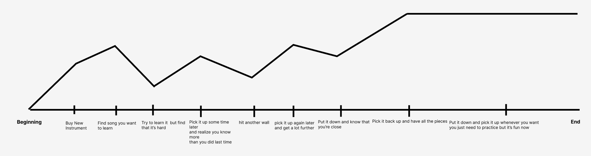
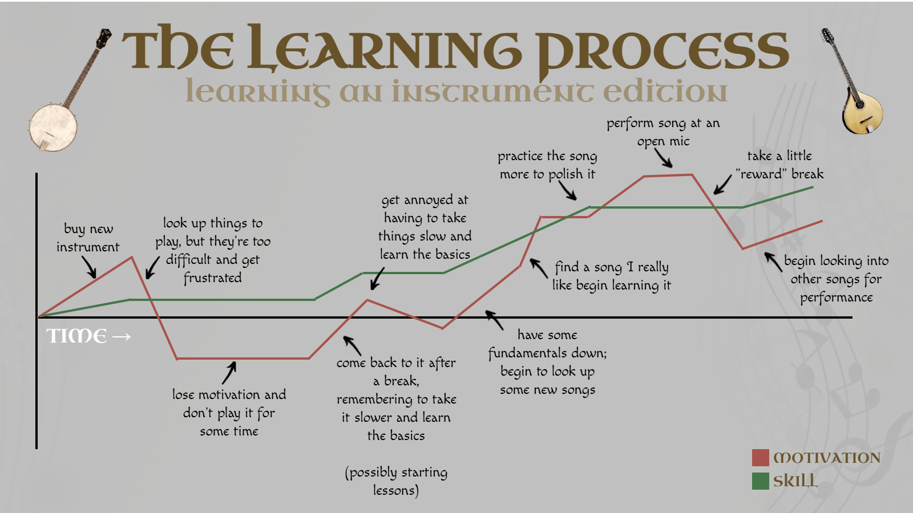

[← All weeks](../)

## 📝Brief

**Named after the Philadelphia 76ers' "Trust the Process" rebuild: years of short-term pain for a long-term payoff. Fitting, given where this map ends up 🤪**

_In class, Silas interviewed me about my learning process and made an
artifact representing how he interpreted it. This assignment asks me to
share his version, redraw my **own** version (filling in what's missing,
correcting what he misread, and marking the emotionally resonant beats), then
use that revised map to find a point of friction and design a practice that puts
that friction to work during another round of technical learning this week._

---

## 🗺️Part 1: Silas' Artifact


_The artifact Silas made after interviewing me about how I learn, using music as a framing device._

When Silas interviewed me, I used music as my reference point for learning. Over the past 5ish years, the most learning I've done has been in a music capacity: learning new instruments (banjo, Irish bouzouki), improving skills at existing instruments (guitar, bass), learning how to write songs (chord progressions, lyrics), performance (live and recorded), and collaborating with other musicians.

Most recently, back in July I bought an [Irish bouzouki](https://en.wikipedia.org/wiki/Irish_bouzouki), and I think it's the most fitting example of how I approach learning something new in a musical context.

---

## ✍️Part 2: My Artifact


_My version of Silas' artifact, redrawn to reflect my actual learning process. Red is motivation and green is skill. The low is "lose motivation," the friction is the "get annoyed" stretch (see [Part 3](#part-3-where-the-friction-lives)), and the peak is the open mic._

This is the version of the artifact that I created to more accurately represent my learning process with a new instrument. Some notable changes:

### 📝What Changed

#### 1. One line → two lines

- **His version:** Just one line, with no label for what it represents. Is this motivation? Skill?
- **My version:** Two separate lines, one for motivation and one for skill.

While skill might not be necessary here, for a learning process chart I think it's helpful at the very least to show improvement and progression. Also, the big issue with my learning process overall (not just music) is the motivation TO learn. It can be hard for me to be self-driven; that's why I enjoy having external accountability or some sort of structure. In the case of music, that means having lessons or an open mic performance as hard deadlines.

#### 2. Adding the outside world

- **His version:** No lessons, no performing, nothing outside of me.
- **My version:** Starting lessons during the comeback, and performing the song at an open mic as the peak.

The highest point of motivation on my map isn't "having all the pieces," it's an external event with a date on it. Lessons, open mics, community, etc. are what actually pull me back in and keep me going (i.e., things with accountability). Leaving them out makes the whole thing look more self-driven than it really is. That's not to say there's NO self-driven motivation, just that the structure helps.

#### 3. Going below the baseline

- **His version:** The line (which I think is motivation) dips, but never below the baseline.
- **My version:** The line now dips below the baseline to show low motivation, and rises above it to show high motivation.

It could be argued there's no such thing as "negative motivation," only "no motivation", so dipping below a baseline doesn't make sense. However, the lows aren't just "a little less excited." At the bottom I'm actively not playing, and the instrument just collects dust. Letting the line go negative shows how far motivation can actually fall, and how much it takes to pull it back up. At the very least, the motivation needs to dip to 0 to reflect complete lack of engagement.

#### 4. Songs come first

- **His version:** Finding a song I want to learn is one of the first steps, right after buying the instrument.
- **My version:** The songs come first, before I buy the instrument. I only get back to them once I have some fundamentals down.

Hearing songs I love on an instrument is a big part of why I want to learn it in the first place. For example, with the Irish bouzouki, some of the Irish folk songs in the movie _Sinners_ (namely "The Rocky Road to Dublin" and "Will Ye Go Lassie Go?") are what initially piqued my curiosity. But these are also ones I can't play yet, so trying them right away is what leads to the first low. Getting back to a song I really like later, once I can actually play it, is what closes that loop.

#### 5. No ending

- **His version:** Ends in a steady plateau: "it's fun now."
- **My version:** No end. After the open mic I take a "reward" break, then start looking into new songs to perform.

It loops. Motivation drops again after every goal, which is why I need the next one lined up.

### 🔥Emotionally Resonant Points

> **Putting it down - _the low_**: After buying the instrument, I look up things to play that end up being way too difficult, get frustrated, and stop playing for a while. This is the only spot on my map where both lines go flat; motivation is below zero, and skill doesn't move because I'm not picking it up at all. It carries more weight than the other dips because it's the one where the whole thing could just end, and I let the instrument rot in a corner for the rest of time.
>
> This is a common thing with ALL instruments I've learned, and something that I have to consciously push through if I want to keep progressing. When I was learning saxophone, my first private lesson instructor used the saying "How do you eat an elephant? One bite at a time." In a much less entertaining case, my college saxophone professor used to say to practice a problematic phrase 10 times at a slower tempo, and ONLY once you got it perfectly all 10 times, you could bump it up in tempo; rinse and repeat until you're up to speed.
>
> In all cases, it's a matter of taking it slow. I'm a person who LOVES to rush into things, and wants to be good NOW. But progress comes incrementally, and patience is key to mastering an instrument. Or, all learning, for that matter.

> **The open mic - _the click_**: Performing the song at an open mic is the peak of the whole map. What triggers it is having a real date on the calendar. It turns "I should practice" into "I have to be ready," and all the slow, tedious practicing work before it suddenly has a point.

---

## ⚡Part 3: Where the Friction Lives

The friction on my map shows up where I "get annoyed at having to take things slow and learn the basics." It happens after I come back from a break and commit to the basics, or to easier songs I can actually learn on. My skill line goes up during this stretch, but my motivation line goes down, because the progress feels too slow to count. My usual way out is to skip ahead to a song I really like before I'm ready. Sometimes I power through, but other times it puts me right back in the "too difficult, get frustrated" low from the start.

That annoyance means I'm working at the edge of what I can do, before it pays off. It's also why finding a song I really like later feels so good: I wanted it and worked for it. If I engineered the friction away by only playing things I already like, I'd stay stuck, and I'd lose the gap between effort and payoff that makes the open mic such a high point.

---

## 🔁Part 4: The Practice

For this week's technical learning, I went back to [Strudel](https://strudel.cc/), the live-coding music tool from [last week](../week-3-teach-me-teach-you/). Strudel is meant for live-coding and improvisation, so this time the goal was to write a song that could evolve and be arranged, not just a basic loop.

In my opinion, it's a fair test of friction because it's the same setup as the bouzouki: a steep learning curve, and wanting to jump in and do crazy things without a good foundation. The practice is the coding version of "one bite at a time": watch an example, pause, and try out one new concept, without adding the next one until that one works.

I also borrowed from how Silas learns. When I interviewed him, he talked about watching videos at his own pace (pausing, skipping, watching at higher speeds) and making sure he has time to tinker. Staying focused is something I struggle with too, so I did the same: look at an example, then pause to play around a bit on my own before moving on.

The practice uses the friction itself as the cue. When I feel the urge to layer on a second new method before the first one is working, or the code breaks, that's when I stop piling on, pause, re-watch the example, and go back to adding just one thing.

### 📈How It Went

I spent all of last week complaining about how annoying Strudel was, but this time around I found it more intuitive and enjoyable. It's still a VERY steep learning curve, but a) I had a better foundation from last week, albeit not much, and b) I did a better job of setting up my own learning process. The times it broke were the times I tried to combine multiple concepts at once, backing up the"one tinker at a time" approach.

### 🎵The Result

The final piece is built in sections instead of one loop. The melody (two lines in A minor, panned left and right) starts alone. The bass comes in after 12 cycles, the chords drop in and out every 12, and the drums join at 24. The snare/rimshot and ride/hi-hat parts also swap every 12 cycles, so the groove keeps changing as it plays.

[Open it in Strudel](https://tinyurl.com/4u96ucpt) to play it and see the code run live.

<audio controls src="audio/beat-2.wav">
  Your browser does not support the audio element. <a href="audio/beat-2.wav">Download the audio</a> instead.
</audio>

<details class="contraband" markdown="1">
  <summary>View the Strudel code</summary>
  <div class="body" markdown="1">

```
const ratchet = register('ratchet', (pat) => pat.sometimes(ply(2)))

setcpm(90 / 3)

// Drums
const kick = "x ~ x ~ ~ ~ ~ ~ ~ ~ x ~"

const drums = stack(
  s("bd").struct(kick),

  // Snare and rimshot, alternating every loop
  arrange([12, s("sd")], [12, s("rim")])
    .struct("~ ~ ~ ~ x ~ ~ x ~ x ~ x"),

  // Ride and hi-hat, alternating every loop
  arrange([12, s("rd")], [12, s("hh")])
    .struct("x*6")
    .gain(0.5),

  // Crash at the start of each section
  arrange([8, s("cr").slow(8)], [4, s("cr").slow(4)])
    .gain(0.7)
).bank("tr505")

// Chords
const progression = chord(arrange(
  [2, "Dm7"], [2, "G7"], [2, "Dm7"], [2, "G7"],
  [2, "Fmaj7"], [1, "G7"], [1, "Em7"]
))

const chords = progression
  .voicing()
  .s("sawtooth")
  .lpf(1000)
  .attack(0.05).release(0.4)
  .room(0.5)
  .gain(0.25)

// Bass: chord roots, locked to the kick
const bass = progression
  .rootNotes(2)
  .s("sawtooth")
  .lpf(400)
  .decay(0.2).sustain(0)

// Melody
const a = "0 ~ 3 ~ 5 0"
const b = "-1 ~ 3 ~ 5 0"
const c = "-2 ~ 1 ~ 3 2"

const melody = stack(
  n(arrange(
    [2, a], [2, b], [2, a], [2, b], [2, c],
    [1, "-1 ~ 3 ~ 5 4"],
    [1, "4 ~ 3 ~ 1 -1"]
  )).pan(0.25),
  n(arrange(
    [8, "5 6 ~ 6 ~ 3"],
    [2, "7 7 ~ 8 ~ 7"],
    [1, "7 ~ 6 ~ 5 ~"],
    [1, "4 ~ ~ ~ ~ ~"]
  )).pan(0.75)
)
  .scale("A4:minor")
  .s("triangle")
  .delay(0.3)
  .room(0.4)
  .gain(0.5)

// Arrangement
stack(
  drums.filterWhen(t => t >= 24),
  melody,
  arrange([12, silence], [12, chords]),
  bass.filterWhen(t => t >= 12)
)
```

  </div>
</details>

Compared to [last week's](../week-3-teach-me-teach-you/) two-chord loop, this one has an actual arrangement: parts enter over time and sections alternate.

---

## 💭Reflection

Honestly, this assignment might be the biggest takeaway from the class thus far: dissecting how I learn, and putting an emphasis on improving it. Over the last few years and with the rise of AI in my profession of software engineering, I think I somewhat lost touch with learning, so putting it under a microscope is a good way to notice "oh wait, I need to get back to it".

It's a little funny reading this next to [Week #3](../week-3-teach-me-teach-you/#reflection), where I spent most of the page bitching about how hard Strudel was to get into. Now here I am, arguing that friction is worth keeping. I think the difference is _where_ the friction is. Struggling with the syntax, arrangement, etc. is the useful kind: it's the "edge of what I can do" stretch from [Part 3](#part-3-where-the-friction-lives); i.e., it's "delayed gratification". Struggling to find the beginner docs in the first place isn't. That friction doesn't teach me anything about making music; it just makes me want to quit before I start.

It's interesting that my [Week #1](../week-1-magical-interface/) project ended up being so similar. Someone tells me how they learn, and I turn around and make something related. Though, Week #4 was more about diving deeper into the learning itself, whereas Week #1 was attempting to make something to address the issues. To tie it to [Week #5](../week-5-cognitive-reloading/)'s prototype learning, Week #4 was the research step of the prototyping process, and Week #1 was making the prototype itself from the feedback.
