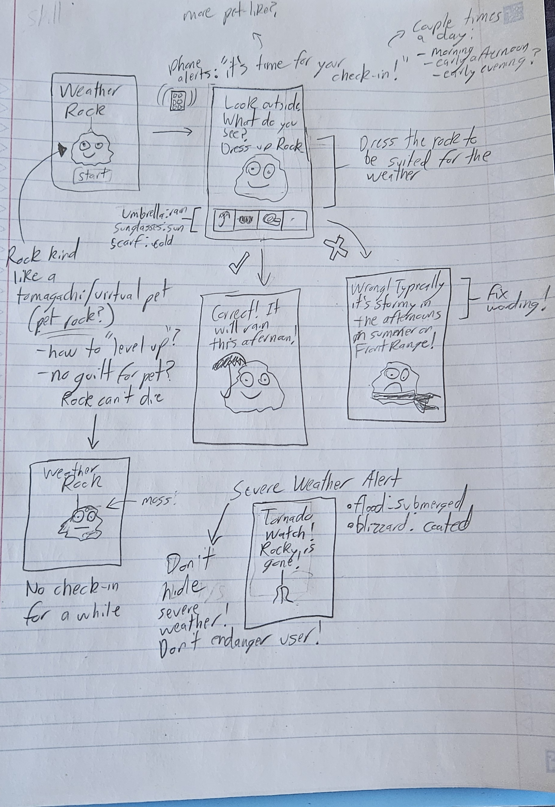

[← All weeks](../)

**Contents**

<!-- prettier-ignore -->
* TOC
{:toc}

## 📝Brief

> ⚠️ I was out of class the day groups formed, so I did this one as an individual exercise.

_Thanks to the miracles of technology, we've extended our capability into the world: navigation, memory, coordination, conversation! And yet, there are those amongst us who desire to take back certain functions from the machine. Develop a prototype application that is built to gradually transfer the cognitive workload back to the user._

_For example, what would a navigation app look like that was trying to teach you how to navigate better via landmarks? Or a camera app that helps you form durable visual memories?_

**Brainstorm:**

1. List tools we use to extend our conscious capabilities.
2. Note which cognitive processes each of those tools lets us offload.
3. Zero in on one cognitive skill someone might want to reclaim.
4. Consider their motivations: what do they really want to gain control over?

**Then:** sketch/prototype concepts for 20 minutes, pick the strongest direction, and build it out as a Figma prototype for presentation next class.

---

## 🧠Brainstorm

I had the benefit of looking at everyone else's presentations before I did this assignment, so I avoided doing any topic other group did: music streaming, social media, cooking/food, language/grammar, etc. Thus, for brainstorming, I came up with:

| Tool                    | What it offloads                                                                           |
| ----------------------- | ------------------------------------------------------------------------------------------ |
| 📇 Contacts             | Phone numbers, birthdays, addresses                                                        |
| 📅 Calendar             | Upcoming events                                                                            |
| ✅ To-do List           | Holding / prioritizing tasks in your head                                                  |
| 🧮 Calculator           | Mental math, estimating                                                                    |
| 🔍 Google search        | Remembering facts ("I'll just look it up")                                                 |
| 🌿 Plant / bird ID apps | Identifying plants, birds, and trees                                                       |
| ⌚ Fitness trackers     | Tracking workouts and diets (calories, protein, etc.); noticing recovery and sleep quality |
| 🌦️ Weather app          | Reading the sky, wind, and seasonal patterns                                               |
| 💰 Budgeting            | Tracking where your money goes; creating budgets and "balancing checkbooks" by hand        |
| ⏰ Clocks / timers      | Sense of time passing, estimating durations                                                |

### 🌦️What I Chose: Weather

Partially for the goofy factor, and partially for the challenge, I chose weather. Not whole-day or future forecasting; after all, we've spent centuries developing technologies and methodologies to "predict" the weather and still do a pretty mediocre job. Instead, more short-term observations tied to when you need it. For example, looking at the sky and based on seasonal weather trends, will it rain in the next few hours, or can I go on that hike?

The motivation is threefold:

1. _Know more about weather patterns_: For thousands of years, professions like farmers and sailors didn't have access to weather prediction. They had to read the sky and use seasonal weather patterns in their local geography to "predict" what any given day would do. For example, the [phrase](https://en.wikipedia.org/wiki/Red_sky_at_morning) "Red sky at night, sailors' delight; Red sky at morning, sailors take warning" was invented to be a sort of weather-prediction idiom.
2. _Have a greater connection to your local surroundings_: Using a weather app is having your face on a screen instead of in the world around you; this app would force you to look at the sky, observe nature, and generally get a little more in touch with the world. To use meme lingo, it'd help you "touch grass", which IMO is is especially relevant and important along the Front Range.
3. _Be self-reliant when technology isn't there_: Out on a trail with no signal, a weather app can't tell you that the clouds stacking up over the mountains mean lightning by 2pm. Forecasts are also made for a whole region, not the exact spot you're standing in an hour from now. Being able to read the sky yourself means you can make the call to turn around (or keep going) on your own.

### 🪨Weather Rocks

When I decided on weather, I immediately thought of [weather rocks](https://en.wikipedia.org/wiki/Weather_rock), which honestly kind of a meme before memes were a thing (see [this website](https://myweatherrock.com/weather-rock), for example). In Boy Scouts, our camps often had weather rocks as a joke, and I've seen it used elsewhere for similar reasons. Essentially, it's a rock that's hung up with a list of rules, typically like:

> - If the rock is wet, it's raining.
> - If the rock is swinging, the wind is blowing.
> - If the rock casts a shadow, the sun is shining.
> - If the rock does not cast a shadow and is not wet, the sky is cloudy.
> - If the rock is difficult to see, it is foggy.
> - If the rock is white, it is snowing.
> - If the rock is coated with ice, there is a frost.
> - If the ice is thick, it's a heavy frost.
> - If the rock is bouncing, there is an earthquake.
> - If the rock is under water, there is a flood.
> - If the rock is warm, it is sunny.
> - If the rock is missing, there is a tornado.
> - If the rock is wet and swinging violently, there is a hurricane.
> - If the rock can be felt but not seen, it is night time.
> - If the rock has white splats on it, watch out for birds.
> - If there are two rocks, you're drunk.

_Source: Wikipedia._

The rock boasts an "100% success rate", since it only reports what's happening currently. Which, while being "haha silly rock joke", has some actual application. The principle of a weather rock is essentially "just look around", which is what I want the app to help someone do to for their own weather forecasting.

Also, another "humorous" concept related to rocks is [pet rocks](https://en.wikipedia.org/wiki/Pet_Rock), which are literally just rocks that you pretend are pets. Combining these two ideas, I came up with the idea of having the app be a "virtual pet" (think a [Tamagotchi](https://en.wikipedia.org/wiki/Tamagotchi)), where you check-in and predict the weather to help care for your "pet weather rock".

## ✏️20-Minute Sketch

_My 20-minute sketches for Weather Rock: the check-in loop, right/wrong results, no check-in, and the severe weather alert._

I wanted to lean heavily into the "virtual pet" with this, so making the driving approach "caring" for the rock feeds into the usage of the app. Visually, it should also reflect the "weather rock" rules above; i.e., after predicting, a rock should be covered in snow if it is snowing.

**What the sketch figured out:**

- Dressing up the rock _is_ the prediction: umbrella = rain, sunglasses = sun, scarf = cold, etc. It's much more engaging than a dropdown or text-based quiz.
- Check-ins happen a couple of times a day (morning, early afternoon, early evening), with a phone alert.
- The rock can't die. If there's no check-in for a while, it just gets mossy. No guilt!
- Right/wrong results show up on Rocky: smiling under an umbrella when you called the rain, or sad and cold when you didn't.
- Severe alerts break through no matter what, which is where "if the rock is missing, there is a tornado" comes in ("Rocky is gone!"). These should reflect the weather rock rules for severe weather: a flood leaves Rocky submerged, a blizzard leaves it coated in ice, etc.

**Open questions:** There are a few other apps that use virtual pets to drive a larger purpose (for example, [Finch](https://finchcare.com/) for self-care), so I'll need to do some research about how apps like that work. Some questions I still have:

- _Tamagotchis_ have growth stages (baby, child, teen, adult); presumably we want something similar to show progression of weather-reading skill.
- How do we make a rock compelling, and/or give it a personality? It should feel more pet-like than it does in the sketch.
- This is essentially gamifying the weather, and gamification can get obsessive; I wouldn't want this to turn into something like Duolingo. How do we make the app engaging and fun, but also simple and not overbearing?
  - Some things I'd want to avoid: streaks, leaderboards, in-app purchases, etc.

## 📱Prototype for Weather Rock

**▶️ Clickable prototype:**

<iframe
  style="border: 1px solid rgba(0, 0, 0, 0.1); width: 100%; height: 700px;"
  src="https://embed.figma.com/proto/BJuLdXW24TB3eIOg1KjOYT/%E2%9B%85Weather-Rock%F0%9F%AA%A8?node-id=37-2&p=f&scaling=scale-down&content-scaling=fixed&page-id=0%3A1&starting-point-node-id=42%3A30&embed-host=share"
  allowfullscreen>
</iframe>

[Open the prototype in Figma ↗](https://www.figma.com/proto/BJuLdXW24TB3eIOg1KjOYT/%E2%9B%85Weather-Rock%F0%9F%AA%A8?node-id=37-2&p=f&scaling=scale-down&content-scaling=fixed&page-id=0%3A1&starting-point-node-id=42%3A30)

**🎨 Design file (all screens):**

<iframe
  style="border: 1px solid rgba(0, 0, 0, 0.1); width: 100%; height: 600px;"
  src="https://embed.figma.com/design/BJuLdXW24TB3eIOg1KjOYT/%E2%9B%85Weather-Rock%F0%9F%AA%A8?node-id=0-1&embed-host=share"
  allowfullscreen>
</iframe>

[Open the design file in Figma ↗](https://www.figma.com/design/BJuLdXW24TB3eIOg1KjOYT/%E2%9B%85Weather-Rock%F0%9F%AA%A8?node-id=0-1)

TODO

## 💭Reflection

_What I learned._
