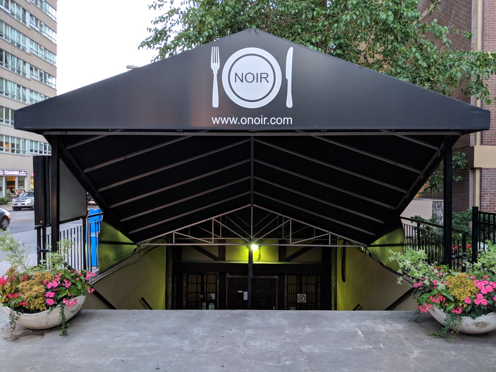

[← All weeks](../)

**Contents**

<!-- prettier-ignore -->
* TOC
{:toc}

## 📝Brief

_In prep for a conversation on multisensory design, read pages 14-23 of Ellen Lupton's_ The Senses _([ProQuest](https://ebookcentral.proquest.com/lib/ucb/detail.action?docID=5348705))._

_Next, reflect on one designed experience that was not primarily visual, noting how its creators leveraged your other senses to shape the experience. Then read the chapter from_ The Senses _on the specific sense it triggered (touch, sound, smell, and flavor are covered on pages 39-72) and create a reflection (written, 300-500 words, or a 2-4 minute recording) recounting the experience and connecting the dots between the reading and what you felt._

---

## 👅Multisensory Experience: O.Noir in Toronto

During a family vacation to Toronto several years ago (I think 2013 or 2014?), we ate at a restaurant called [**O.Noir**](https://www.onoirtoronto.com/). The shtick, as the name suggests if you know some French, is that the dining room is pitch-black. The idea is that losing one sense heightens the others, so the food tastes better. That claim is [often](https://www.allaboutvision.com/resources/human-interest/losing-vision-stronger-senses/) [debated](https://www.scienceabc.com/humans/does-losing-one-sense-improve-the-others), but I'm convinced after visiting; the steak I got there was one of the best I've had in my life.

There are several aspects of the restaurant that build on "blindness":

1. All the servers are visually impaired, so the dark barely affects them, and the people guiding you are the ones most at home in the space. Guests walk in single file (basically a conga line), each holding on to the person in front, with the server leading.
2. There are no in-restaurant menus, so ordering happens entirely by voice, requiring you to pay attention and remember what the server says. There's a menu in the lit-up lobby, but that's also a memory exercise to remember something that you may have looked at over 10 minutes ago.
3. Locations of dishes, silverware, and cups are all specified by "o'clock" position relative to you, which requires deliberate carefulness not to spill, drop things, etc.
   - Even then, I remember they recommended eating with your hands as much as possible, and basically were like "spills happen."
4. There are lots of small rules to ensure darkness unless there's an emergency: no electronics or light sources (unless required), no wandering, the server must guide you to the bathroom, etc.

Each choice hands the work sight normally does over to touch, sound, smell, and taste.

_O.Noir in Toronto, Canada._

### 💭Reflection on the Experience

Lupton's Flavor chapter argues that "flavor is smell" and "flavor is tactile," and the book more broadly says the senses "merge and mingle." So while a "blind" restaurant is mainly about flavor, the whole meal showed how much flavor depends on everything else. Chronologically:

1. _Getting seated_: Our conga line followed the server into the pitch-black seating area. Holding on to the person ahead was the only way to know where we were, which tracks with "touch is spatial." Finding our chairs was "active" touch: reaching out and exploring with our "specialized" hands/fingertips to search for familiar textures/shapes, instead of just bumping into things.
2. _Ordering_: Without menus at the table, ordering took real focus; the reading describes communication as a mix of sound and gesture, but the dark removed the gesture part. Sound also became "synesthetic": a fork clinking against a plate primed me to "see" it, not visually but as a mental picture.
3. _Table talk_: Conversation felt more spatial, since I tracked who was talking by where their voice came from. Without faces or gestures to read, the words needed more attention.
4. _Eating_: This is where the other senses combined their powers, Captain Planet style. People say "you eat with your eyes," but we couldn't use them, so judging the food before and after the first bite fell to everything else:
   - _Smell_: My olfactory bulb picked up the scent of freshly grilled steak: the char, the marinade, etc.
   - _Touch_: My tongue assessed the tenderness I expect from a medium-rare steak, and my fingers felt the juices as I hunted on my plate for the steak.
   - _Sound_: Hearing the juices as I cut pieces of the steak painted a mental picture of it.

O.Noir is built around flavor, but as the Flavor chapter argues, flavor comes from smell, touch, and sound. Taking away sight made each of those contributions impossible to miss, and I think that's why the steak was so memorable and tasty. It was a super cool experience, but I was definitely getting pretty antsy by the end, just due to not being able to see. At the very least, it made me appreciate my sight a little more.
